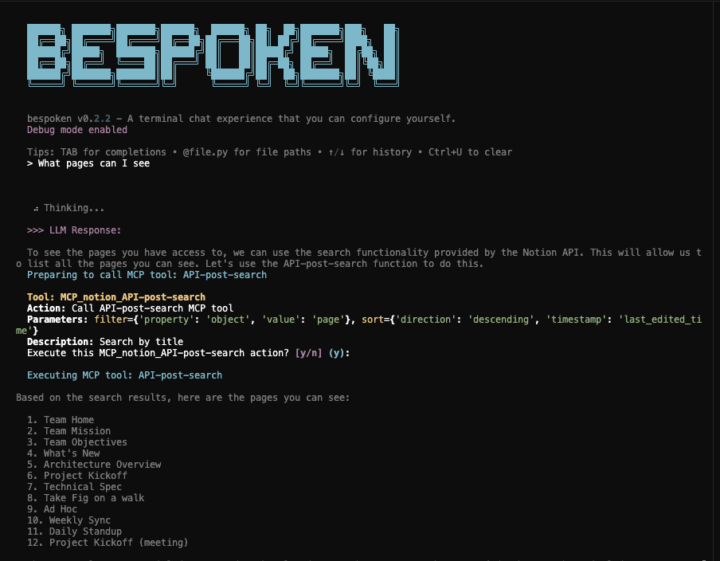

# LLM MCP Plugin

[](https://github.com/d-lowl/llm-mcp-plugin/actions/workflows/ci.yml)
[](https://github.com/d-lowl/llm-mcp-plugin/actions/workflows/test.yml)

**IMPORTANT: This is a very early version of the MCP wrapper for [llm](https://llm.datasette.io/) and [Bespoken](https://bespoken.ai/), largely written by Claude and barely tested. Proceed with caution.**

A plugin for the [LLM](https://llm.datasette.io/) command-line tool that enables using [Model Context Protocol (MCP)](https://modelcontextprotocol.io/) servers as toolboxes in conversations.

## Features

- **Dynamic MCP Server Integration**: Connect to any MCP server and expose its tools as LLM toolbox methods
- **Multiple Transport Support**: Works with stdio, SSE, and HTTP-based MCP servers  
- **Automatic Tool Discovery**: Automatically converts MCP tools into callable methods
- **Resource & Prompt Access**: Expose MCP resources and prompts through the toolbox
- **Configuration-Driven**: Easy setup for different MCP servers via configuration files
- **STDERR Handling**: Control how MCP server error output is handled (disable, redirect to file, or display in terminal)

## Installation

```bash
uv add git+https://github.com/d-lowl/llm-mcp-plugin.git
```

## Quick Start

Usage in Bespoken:

```python
mcp_toolbox = MCPToolbox(
    config=MCPServerConfig(
        name="notion",
        transport="stdio",
        command="npx",
        args=["-y", "@notionhq/notion-mcp-server"],
        env={
            "OPENAPI_MCP_HEADERS": f'{{"Authorization": "Bearer {NOTION_API_KEY}", "Notion-Version": "2022-06-28" }}'
        }
    )
)

chat(
    model_name="anthropic/claude-3-5-sonnet-20240620",
    tools=[TodoTools(), mcp_toolbox],
    system_prompt=SYSTEM_PROMPT,
    debug=True,
    slash_commands={
        "/thinking": "Let me think through this step by step:",
        "/role": set_role,
        "/whoami": whoami,
    },
)
```

(I haven't done any testing in bare llm yet, but it should work.)

## Examples

This repo contains an example Bespoken agent script for Notion.

```bash
export NOTION_API_KEY=your-notion-api-key
export ANTHROPIC_API_KEY=your-anthropic-api-key

./notion_example.py
```



## Supported MCP Servers

This plugin works with any MCP server that follows the [Model Context Protocol specification](https://spec.modelcontextprotocol.io/). Some examples:

- [Toggl Track MCP](https://github.com/fuzzylabs/toggl-track-mcp) - Time tracking integration
- [Filesystem MCP](https://github.com/modelcontextprotocol/servers/tree/main/src/filesystem) - File system operations
- [Git MCP](https://github.com/modelcontextprotocol/servers/tree/main/src/git) - Git repository management
- [SQLite MCP](https://github.com/modelcontextprotocol/servers/tree/main/src/sqlite) - Database operations

## License

MIT License. See [LICENSE](LICENSE) for details.

## Contributing

Contributions welcome! Please read [CONTRIBUTING.md](CONTRIBUTING.md) for guidelines.
